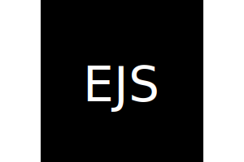
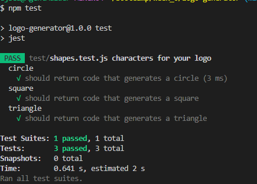

# Logo Generator

## Description
### Upon running index.js in a terminal, the user will be asked a series of questions (text up to 3 characters, its color, the shape of the logo, and its background color) that will in turn generate a logo in SVG format. 
---

## SVG Example
### 
---

## Testing
### Result of running the npm test command in the terminal:
### 